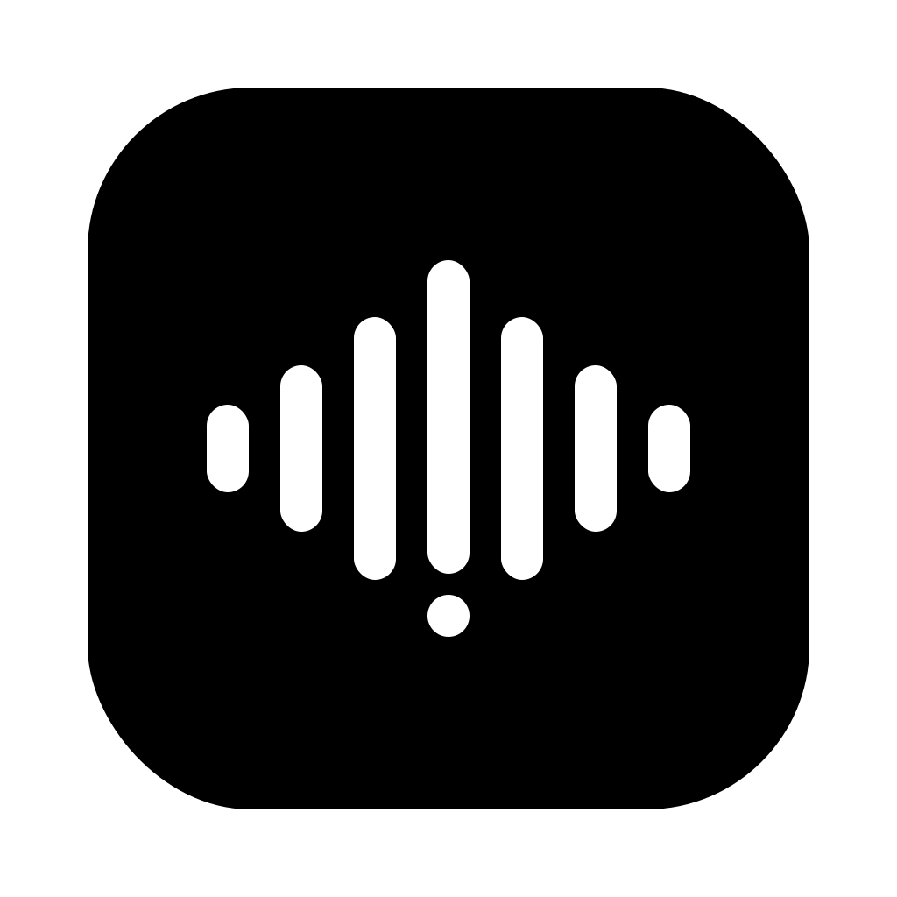

<p align="center">
  
</p>

<h1 align="center">Undertone</h1>

<p align="center">
  <strong>System-wide voice dictation for macOS. Fully local — audio never leaves your Mac.</strong>
</p>

Press a hotkey anywhere, speak, and properly punctuated text appears at your
cursor. Transcription runs on the Neural Engine (NVIDIA Parakeet TDT v3 via
Core ML), with optional post-processing by any local LLM — rewrite dictation
as a chat message, an email, bullet notes, or a precise prompt for a coding
agent. No accounts, no cloud, no telemetry.

## Features

- **Dictate anywhere** — tap ⌘⇧Space to start/stop, or hold it like a
  walkie-talkie; Esc cancels. Text is inserted into whatever app has focus.
- **Live floating HUD** — a translucent capsule with a real waveform, a timer,
  and your words appearing as you speak; it morphs through transcribe →
  enhance → insert and flashes the outcome.
- **Two engines, one picker** — Parakeet v3 (default: ~110× realtime on the
  Neural Engine, punctuation built in, 25 European languages) or Whisper via
  WhisperKit (100 languages, custom-vocabulary biasing, model sizes from Tiny
  to Large v3 Turbo).
- **AI modes** — per-task prompts (Message, Email, Notes, Prompt) powered by
  any OpenAI-compatible local server (Ollama, LM Studio, llama-server), with
  per-app auto-switching: dictating in Slack can use Message mode, in Mail,
  Email mode. Plain transcription needs no LLM at all.
- **Custom vocabulary** — bias recognition toward names and jargon; optional
  hard-correction rules ("just pay" → "Juspay").
- **History & stats** — searchable local history of every dictation, plus
  words dictated, speaking WPM, and time saved vs typing.
- **Guided setup** — live permission checks and one-click model downloads, so
  the first dictation never stalls on a surprise.

## Requirements

- macOS 14.4+, Apple Silicon
- Xcode 15.4+ command-line tools (to build)
- Optional: [Ollama](https://ollama.com) (or LM Studio / llama-server) for the
  AI modes — dictation works without it

## Build & install

```sh
make app                                 # build + assemble + ad-hoc sign dist/Undertone.app
cp -R dist/Undertone.app /Applications   # install
open /Applications/Undertone.app         # a waveform icon appears in the menu bar
```

The Setup window opens on first launch: grant Microphone and Accessibility,
download the speech model (~500 MB, one time), and dictate. Everything runs
offline from then on.

TCC permissions (microphone, Accessibility) require a real signed `.app`
bundle, which is why `make app` exists — running the bare SwiftPM binary won't
get stable permission grants. Xcode users can also `open Package.swift`.

## Architecture

Start with [ARCHITECTURE.md](ARCHITECTURE.md) — component deep-dives,
technology trade-offs, the permissions model, and the phased roadmap. The code
under `Sources/` mirrors it one-to-one.

## Attribution

Speech recognition is powered by [NVIDIA Parakeet TDT 0.6B v3](https://huggingface.co/nvidia/parakeet-tdt-0.6b-v3)
(CC-BY-4.0) running on the Neural Engine via [FluidAudio](https://github.com/FluidInference/FluidAudio)
(Apache 2.0), with [OpenAI Whisper](https://github.com/openai/whisper) via
[WhisperKit](https://github.com/argmaxinc/WhisperKit) (MIT) as the selectable
multilingual / custom-vocabulary engine. Global shortcuts by
[KeyboardShortcuts](https://github.com/sindresorhus/KeyboardShortcuts) (MIT).
Inspired by [Superwhisper](https://superwhisper.com) — if you want a polished
commercial product rather than a hackable local one, go buy it.

## License

[MIT](LICENSE)
